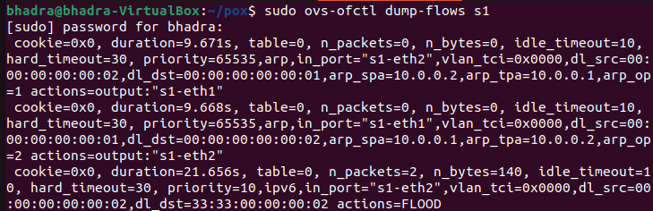

# Flow-Timeout-Manager


# SDN Flow Rule Timeout Manager (POX + Mininet)

## 📌 Problem Statement

This project implements a Software Defined Networking (SDN) solution using Mininet and a POX controller to demonstrate flow rule timeout management.

The objective is to:

* Demonstrate controller–switch interaction
* Implement match–action flow rules using OpenFlow
* Analyze network behavior using flow rule timeouts

---

## 🧠 Concepts Used

* Software Defined Networking (SDN)
* OpenFlow protocol
* Flow rules (match–action)
* PacketIn events
* Idle timeout
* Hard timeout

---

## ⚙️ Setup Instructions

### 1. Start POX Controller

```bash
cd ~/pox
./pox.py log.level --DEBUG openflow.of_01 ext.flow_timeout_manager
```

### 2. Start Mininet

```bash
sudo mn --topo single,2 --mac --switch ovsk --controller remote
```

---

## ▶️ Execution Steps

### Test connectivity (Ping)

```bash
h1 ping -c 3 h2
```

### View flow table

```bash
sudo ovs-ofctl dump-flows s1
```

### Test throughput (iperf)

```bash
h2 iperf -s &
h1 iperf -c h2
```

---

## 🔁 Expected Behavior

* Controller installs flow rules dynamically
* Each flow rule has:

  * idle_timeout = 10 seconds
  * hard_timeout = 30 seconds
* Flow rules are removed automatically:

  * After inactivity → idle timeout
  * After fixed time → hard timeout

---

## 📊 Proof of Execution

### Flow Installation


### Flow Table



### Idle Timeout


### Hard Timeout


### Ping Result


### Iperf Result


---

## 📈 Observations

* Idle timeout removes unused flow rules
* Hard timeout removes rules regardless of traffic
* Flow lifecycle is dynamically managed by the controller
* Network performance validated using ping and iperf

---

## ✅ Conclusion

This project successfully demonstrates flow rule timeout management in SDN using POX and Mininet. The behavior of idle and hard timeouts was verified through experimentation and observation.

---

## 📚 References

* POX Controller Documentation
* Mininet Documentation
* OpenFlow Specification
